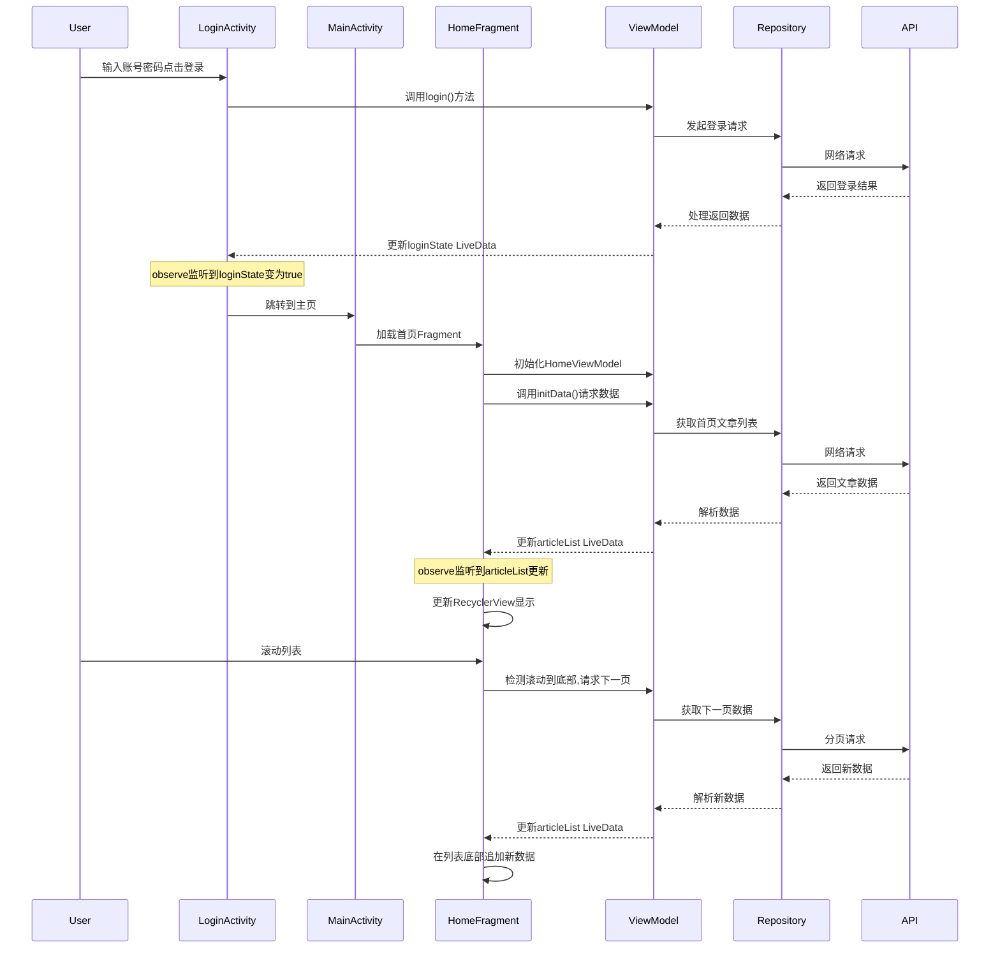

# 结构

## 模块拆分

```text
app/src/main/java/com/yechaoa/wanandroid_jetpack/
├── base                  // 基础框架层
│   ├── BaseActivity      // Activity基类
│   ├── BaseFragment      // Fragment基类
│   ├── BaseRepository    // 数据仓库基类
│   ├── BaseViewModel     // ViewModel基类
│   └── BaseVmActivity    // 带ViewModel的Activity基类
│   └── BaseVmFragment    // 带ViewModel的Fragment基类
├── common                // 公共配置
│   └── MyConfig          // 全局配置常量
├── data                  // 数据层
│   ├── bean              // 数据模型
│   │   ├── Article       // 文章实体
│   │   ├── Navi          // 导航实体
│   │   └── ...
│   ├── http              // 网络请求
│   │   ├── ApiException  // 自定义API异常
│   │   └── ApiService    // 接口服务定义
├── ui                    // 界面层
│   ├── about             // 关于页面
│   ├── adapter           // 适配器
│   │   └── CommonViewPagerAdapter  // 通用ViewPager适配器
│   ├── collect           // 收藏功能
│   ├── detail            // 详情页
│   ├── login             // 登录模块
│   │   ├── LoginActivity     // 登录界面
│   │   ├── LoginRepository   // 登录数据仓库
│   │   ├── LoginViewModel    // 登录视图模型
│   │   └── AgreementDialog   // 协议对话框
│   ├── main              // 主界面
│   │   ├── MainActivity      // 主界面Activity
│   │   ├── home              // 首页模块
│   │   ├── navi              // 导航模块
│   │   │   ├── NaviFragment      // 导航Fragment
│   │   │   ├── NaviRepository    // 导航数据仓库
│   │   │   └── NaviViewModel     // 导航视图模型
│   │   ├── pro               // 项目模块
│   │   └── tree              // 体系模块
│   ├── register          // 注册模块
│   └── search            // 搜索模块
└── util                  // 工具类
    ├── setOnclickNoRepeat  // 防重复点击
    └── randomColor         // 随机颜色工具
```

## 整体结构特性

- 模块化设计

生命周期安全：利用Jetpack组件，实现生命周期安全的数据加载和UI更新
代码解耦：清晰的职责划分，降低模块间耦合度
扩展性好：基于接口和抽象类的设计，便于功能扩展
性能优化：

- ViewPager懒加载策略

- RecyclerView高效复用机制

- 分页加载减轻内存压力

  

用户体验：

- 流畅的列表滚动

- 响应式UI更新

- 友好的加载状态和错误处理

  

该项目遵循了Android现代开发的最佳实践，采用MVVM架构和Jetpack组件，实现了一个结构清晰、易于维护的WanAndroid客户端应用。通过合理的分层设计和状态管理，提供了良好的用户体验和开发体验。


# 功能模块


## 登录后首页加载



